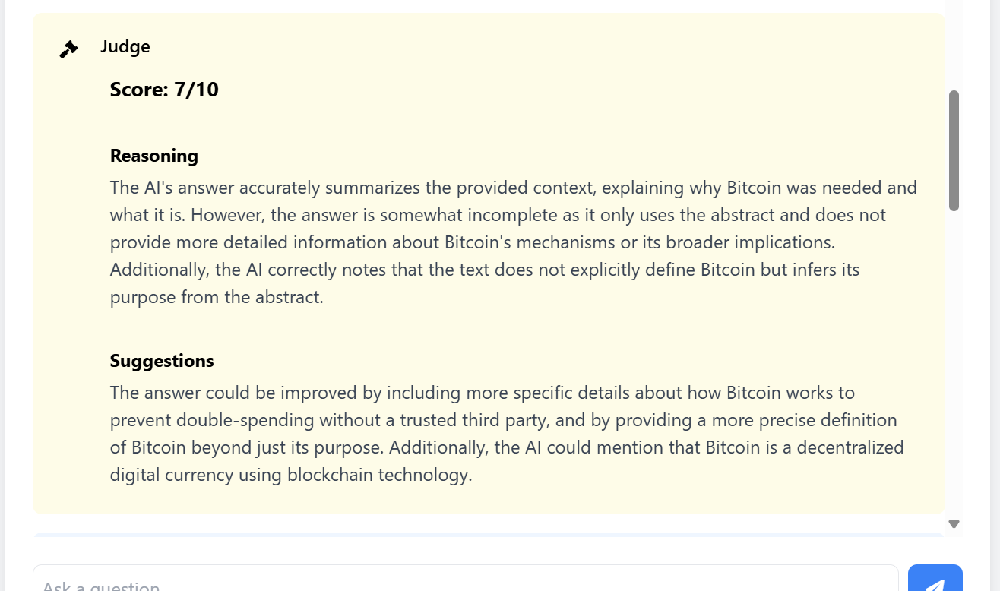

# Dual-LLM System with RAG and Judge Evaluation

This project implements a Question-Answering system using Retrieval-Augmented Generation (RAG) with an additional Judge component that evaluates the quality of responses.

## Resopurces
Created This LLM Using Open Source hugging Face Models Used:

EFor Embedding Utilized Pinecone Inference Api For Searching ANd Querying.
```
LLM_MODEL = "meta-llama/Llama-4-Scout-17B-16E-Instruct"
JUDGE_MODEL = "deepseek-ai/DeepSeek-Prover-V2-671B" 
```


## Project Structure

```
.
├── app.py              # Flask web application
├── hf_clients.py       # HuggingFace models and clients
├── qa_chain.py        # Main RAG implementation
├── requirements.txt    # Project dependencies
├── data/              # Directory for PDF documents
│   └── bitcoin.pdf    # Sample document
└── templates/         # Frontend templates
    └── index.html     # Web interface
```

## Features

- RAG-based question answering using Pinecone vector store
- Integration with HuggingFace models
- Automated response evaluation by a Judge model
- Modern web interface with real-time updates
- Document processing for PDF files

## Setup

1. Create a `.env` file with your API keys:
```
HF_TOKEN=your_huggingface_token
PINECONE_API_KEY=your_pinecone_api_key
PINECONE_ENV=your_pinecone_environment
PINECONE_INDEX_NAME=your_index_name
```

2. Install dependencies:
```powershell
pip install -r requirements.txt
```

## Running the Application

1. Ensure your PDF documents are in the `data/` directory

2. Start the Flask application:
```powershell
python app.py
```

3. Open your web browser and navigate to:
```
http://localhost:5000
```

## Usage

1. Enter your question in the input field
2. The system will:
   - Search relevant content using RAG
   - Generate a response based on the context
   - Evaluate the response quality
   - Display both the answer and evaluation

## Components

- `app.py`: Flask server handling web requests
- `qa_chain.py`: Implements the RAG system using LangChain
- `hf_clients.py`: Manages HuggingFace model interactions
- `index.html`: Modern web interface with real-time updates

## Notes

- The system requires an active internet connection for model access
- Make sure your HuggingFace token has the necessary permissions
- Pinecone vector store must be properly configured
- Large PDF files may take longer to process initially

##Output Images:





